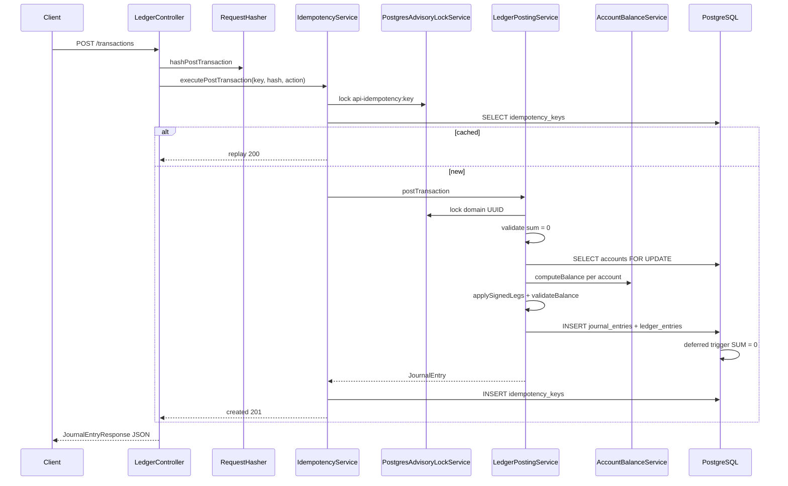

# DoubleLedger — Codebase Flow Guide

> **Goal:** Trace any HTTP request from curl → Java → PostgreSQL, one file at a time.  
> **Tip:** Keep this doc open beside your IDE. Each step says **Open next →** which file to click.

**Related:** [ARCHITECTURE_TEACHING_GUIDE.md](./ARCHITECTURE_TEACHING_GUIDE.md) (why & patterns) · [README.md](./README.md) (curl examples)

---

## Quick start — pick your trace

| I want to trace… | Jump to |
|------------------|---------|
| Post a transfer (`POST /transactions`) | [Trace A](#trace-a-post-transaction) |
| Reverse a transfer (`POST /transactions/{id}/reversals`) | [Trace B](#trace-b-reverse-transaction) |
| Create / read accounts | [Trace C](#trace-c-accounts) |
| Read one transaction | [Trace D](#trace-d-get-transaction) |
| Where errors become JSON | [Trace E](#trace-e-errors) |
| Package / folder map | [Folder map](#folder-map) |
| Database tables | [Database](#database-tables) |

---

## Folder map

```
src/main/java/com/doubleledger/ledger/
├── LedgerApplication.java       ← Spring Boot starts here
├── controller/
│   ├── LedgerController.java    ← ALL HTTP endpoints (start any trace here)
│   └── GlobalExceptionHandler.java
├── dto/                         ← JSON shapes (Request / Response)
├── service/                     ← Business logic
│   ├── LedgerPostingService.java    ← ★ money movement engine
│   ├── IdempotencyService.java      ← HTTP retry cache
│   ├── AccountService.java          ← create / list accounts
│   ├── AccountBalanceService.java   ← balance math (derived from ledger)
│   └── JournalEntryResponseService.java
├── repository/                  ← DB queries (Spring Data JPA)
├── model/                       ← @Entity classes (= table rows)
├── audit/                       ← async forensic logging
├── persistence/                 ← Postgres advisory locks
├── util/                        ← RequestHasher (SHA-256)
├── config/                      ← AsyncConfig (thread pool)
└── exception/                   ← typed errors → HTTP status

src/main/resources/db/migration/
├── V1__initial_ledger_schema.sql    ← tables + zero-sum trigger
└── V2__derived_balances_and_immutable_postings.sql  ← no stored balance; immutable legs
```

---

## The four layers (memorize this)

```
HTTP Request
     │
     ▼
┌─────────────┐
│ Controller  │  LedgerController — JSON in/out only
└──────┬──────┘
       ▼
┌─────────────┐
│ Service     │  Rules, locking, idempotency, balance math
└──────┬──────┘
       ▼
┌─────────────┐
│ Repository  │  SQL via JPA interfaces
└──────┬──────┘
       ▼
┌─────────────┐
│ PostgreSQL  │  Tables, triggers, FOR UPDATE locks
└─────────────┘
```

---

## Accounting in 30 seconds

- **Account** = bucket (wallet, revenue, etc.)
- **Journal entry** = one business event (one transfer)
- **Ledger entry** = one leg of that event
- **Rule:** all legs in a journal entry sum to **zero** (double-entry)
- **Balance** = `SUM(ledger_entries)` per account — **not** stored on `accounts` (V2)
- **Money** = integer cents (`amountMinorUnits: 500` = $5.00)

Request legs use `"DEBIT"` / `"CREDIT"` strings.  
Database stores **signed** amounts: negative = debit, positive = credit.

---

## Trace A: POST transaction

### Sample request

```http
POST /api/v1/transactions
Idempotency-Key: 550e8400-e29b-41d4-a716-446655440000
Content-Type: application/json

{
  "description": "transfer to pool",
  "legs": [
    { "accountId": "<wallet-uuid>", "amountMinorUnits": 500, "direction": "CREDIT" },
    { "accountId": "<pool-uuid>",   "amountMinorUnits": 500, "direction": "DEBIT"  }
  ]
}
```

---

### Step-by-step (follow the arrows)

```
① LedgerController.postTransaction()
       │
       ▼
② RequestHasher.hashPostTransaction()
       │
       ▼
③ IdempotencyService.executePostTransaction()
       │  (inside: PostgresAdvisoryLockService)
       ▼
④ LedgerPostingService.postTransaction()
       │
       ▼
⑤ JournalEntryResponseService.toResponse()
       │
       ▼
⑥ back to IdempotencyService → caches response
       │
       ▼
⑦ LedgerController → JSON to client
```

---

#### ① Controller — HTTP entry

**Open:** `controller/LedgerController.java`  
**Method:** `postTransaction()`

| # | What happens |
|---|--------------|
| 1 | Spring converts JSON → `PostTransactionRequest` |
| 2 | Reads `Idempotency-Key` header; must be UUID |
| 3 | Sets `request.idempotencyKey` from header |
| 4 | Hashes body (step ②) |
| 5 | Calls `IdempotencyService` with lambda `() -> postingService.postTransaction(request)` |
| 6 | Returns 201 (new) or 200 (replay) + optional header `Idempotent-Replayed: true` |

**Open next →** `util/RequestHasher.java`

---

#### ② Hash the request body

**Open:** `util/RequestHasher.java`  
**Method:** `hashPostTransaction()`

Builds SHA-256 of `POST:/api/v1/transactions:` + canonical JSON.

**Why:** Same idempotency key + different body → 409 Conflict later.

**Open next →** `service/IdempotencyService.java`

---

#### ③ API idempotency wrapper

**Open:** `service/IdempotencyService.java`  
**Method:** `executePostTransaction()` → `executeIdempotent()`

| Order | Action |
|-------|--------|
| 1 | `PostgresAdvisoryLockService.acquireTransactionLock("api-idempotency:" + key)` |
| 2 | Look up `idempotency_keys` table |
| 3 | **Hit + same hash** → deserialize cached JSON → return `(response, replayed=true)` |
| 4 | **Hit + different hash** → throw `IdempotencyConflictException` → 409 |
| 5 | **Miss** → run lambda (step ④) → build `JournalEntryResponse` → insert cache row |

**Open next →** `persistence/PostgresAdvisoryLockService.java` (optional — see how lock works)  
**Open next →** `service/LedgerPostingService.java`

---

#### ④ Core posting engine

**Open:** `service/LedgerPostingService.java`  
**Method:** `postTransaction()` → `executePosting()` → `applySignedLegs()`

**4a. `postTransaction()` — domain idempotency**

| Order | Action |
|-------|--------|
| 1 | Advisory lock on domain UUID key |
| 2 | `journalEntryRepository.findByIdempotencyKey()` — already posted? return it |
| 3 | Else `executePosting()` |
| 4 | On `DataIntegrityViolationException` — race? re-query and return existing; else `ForensicAuditService` log |

**4b. `executePosting()` — validate & create header**

| Order | Action |
|-------|--------|
| 1 | Require ≥ 2 legs |
| 2 | `validateLegsBalanceToZero()` — debits = credits in Java |
| 3 | `toSignedLegs()` — DEBIT/CREDIT strings → signed longs |
| 4 | Insert `journal_entries` row (status = posted) |
| 5 | `applySignedLegs(journalId, signedLegs)` |

**4c. `applySignedLegs()` — lock, balance, write legs**

| Order | Action |
|-------|--------|
| 1 | Collect account IDs → **sort** → `findAllByIdsForUpdate()` (`SELECT … FOR UPDATE`) |
| 2 | Verify all accounts exist + same currency |
| 3 | For each account: `accountBalanceService.computeBalance()` (SUM from `ledger_entries`) |
| 4 | For each leg: `applySignedLeg()` → new balance → `account.validateBalance()` (overdraft/frozen) |
| 5 | Build `LedgerEntry` rows with `balance_after` snapshot |
| 6 | `ledgerEntryRepository.saveAll()` |
| 7 | **On commit:** Postgres deferred trigger checks legs sum to zero |

**Open next →** `repository/AccountRepository.java` (see `@Lock PESSIMISTIC_WRITE`)  
**Open next →** `service/AccountBalanceService.java` (balance math)  
**Open next →** `model/Account.java` (only `validateBalance()` — no stored balance field)

---

#### ⑤ Build JSON response

**Open:** `service/JournalEntryResponseService.java`  
**Method:** `toResponse()`

Loads legs from `ledger_entries`, maps via `JournalEntryResponse.fromEntity()`.

**Open next →** `dto/JournalEntryResponse.java` and `dto/LedgerEntryResponse.java`

---

#### ⑥⑦ Cache + return

Back in `IdempotencyService`: persist row in `idempotency_keys`.  
Back in `LedgerController`: `idempotentResponse()` sets status 201 vs 200.

---

### Trace A — sequence diagram



---

### Trace A — database after $5 transfer

**Before:** wallet = 10000¢, pool = 0

| Table | Change |
|-------|--------|
| `journal_entries` | +1 row (header) |
| `ledger_entries` | +2 rows (wallet −500, pool +500 signed) |
| `accounts` | **no balance column** — balance is derived from new legs |
| `idempotency_keys` | +1 cached HTTP response |

---

## Trace B: Reverse transaction

```http
POST /api/v1/transactions/{journalEntryId}/reversals
Idempotency-Key: <new-uuid>
Content-Type: application/json

{ "description": "undo transfer" }
```

### Follow the arrows

```
① LedgerController.reverseTransaction()
       ▼
② RequestHasher.hashReverseTransaction()
       ▼
③ IdempotencyService.executeReverseTransaction()   ← same pattern as post
       ▼
④ LedgerPostingService.reverseTransaction()
       ▼
⑤ executeReversal()
```

**Open:** `service/LedgerPostingService.java`  
**Method:** `reverseTransaction()` → `executeReversal()`

| Order | Action |
|-------|--------|
| 1 | Domain idempotency lock + check (same as post) |
| 2 | Lock reversal target: `reversal-target:{originalId}` |
| 3 | Load original `JournalEntry` — 404 if missing |
| 4 | `ensureReversible()` — not already reversed, not a reversal-of-reversal |
| 5 | Load original legs; negate each signed amount |
| 6 | Insert **new** `journal_entries` row with `reverses_journal_entry_id` |
| 7 | `applySignedLegs()` — same lock/balance path as post |
| 8 | Set original status → `reversed` |

**Key idea:** History is never deleted. Reversal = new offsetting journal entry.

**Tests:** `test/.../ReversalIntegrationTest.java`

---

## Trace C: Accounts

### POST /api/v1/accounts

```
LedgerController.createAccount()
    → AccountService.createAccount()
        → build Account entity (manual field mapping from DTO)
        → AccountRepository.save()
        → AccountBalanceService.toResponse()   ← balance = 0 (no legs yet)
```

**Open:** `service/AccountService.java`  
**Why not save in controller?** Keeps HTTP layer thin; rules live in service.

### GET /api/v1/accounts/{id}

```
LedgerController.getAccount()
    → AccountService.findById()
        → AccountRepository.findById()
        → AccountBalanceService.toResponse()   ← SUM query on ledger_entries
```

### GET /api/v1/accounts

```
LedgerController.getAllAccounts()
    → AccountService.findAll()
        → AccountBalanceService.toResponses()  ← ONE batch SUM query (not N+1)
```

---

## Trace D: GET transaction

```http
GET /api/v1/transactions/{journalEntryId}
```

```
LedgerController.getTransaction()
    → JournalEntryResponseService.findById()
        → JournalEntryRepository.findById()
        → load legs → JournalEntryResponse.fromEntity()
```

**Open:** `service/JournalEntryResponseService.java`

---

## Trace E: Errors

**Open:** `controller/GlobalExceptionHandler.java`

| Exception | HTTP | When |
|-----------|------|------|
| `MethodArgumentNotValidException` | 400 | Bean validation (if added on DTOs) |
| `IllegalArgumentException` | 400 | Unbalanced legs, bad currency, overdraft |
| `JournalEntryNotFoundException` | 404 | Unknown journal entry id |
| `IdempotencyConflictException` | 409 | Same key, different body / wrong operation type |
| `TransactionAlreadyReversedException` | 409 | Second reversal attempt |
| Other | 500 | Unexpected |

Domain services **throw**; controller advice **maps to HTTP**.

---

## Database tables

**Open:** `V1__initial_ledger_schema.sql` then `V2__derived_balances_and_immutable_postings.sql`

### `accounts`

| Column | Notes |
|--------|-------|
| `account_type` | asset, liability, equity, revenue, expense |
| `allow_overdraft` / `overdraft_limit_minor_units` | checked in `Account.validateBalance()` |
| `status` | active, frozen, closed |
| ~~`balance_minor_units`~~ | **Removed in V2** — balance is derived |

### `journal_entries`

| Column | Notes |
|--------|-------|
| `idempotency_key` | UNIQUE — domain dedup |
| `reverses_journal_entry_id` | Set on reversal rows |
| `status` | posted → reversed (only mutable field) |

### `ledger_entries`

| Column | Notes |
|--------|-------|
| `amount_minor_units` | Signed; sum per journal entry = 0 |
| `balance_after` | Audit snapshot after this leg |
| Immutability | V2 trigger blocks UPDATE/DELETE |

### `idempotency_keys`

| Column | Notes |
|--------|-------|
| `request_hash` | SHA-256 of method + path + body |
| `response_body` | Cached JSON for replays |

---

## Safety nets (where things get blocked)

| Check | File / layer | Failure |
|-------|--------------|---------|
| Legs sum to zero | `LedgerPostingService.validateLegsBalanceToZero` | 400 |
| Legs sum to zero | Postgres deferred trigger | rollback |
| Overdraft / frozen | `Account.validateBalance` | 400 |
| Duplicate domain key | unique + Java re-query | return existing |
| Same API key, different body | `IdempotencyService` | 409 |
| Concurrent same account | `findAllByIdsForUpdate` | wait / serialize |
| Concurrent same idempotency key | `PostgresAdvisoryLockService` | serialize |
| Double reversal | `ensureReversible` | 409 |

---

## Self-trace checklist

Print this and tick boxes as you read.

### Happy path — post transfer

- [ ] `LedgerController.postTransaction`
- [ ] `RequestHasher.hashPostTransaction`
- [ ] `IdempotencyService.executeIdempotent`
- [ ] `PostgresAdvisoryLockService.acquireTransactionLock`
- [ ] `LedgerPostingService.postTransaction` → `executePosting` → `applySignedLegs`
- [ ] `AccountRepository.findAllByIdsForUpdate`
- [ ] `AccountBalanceService.computeBalance` + `applySignedLeg`
- [ ] `Account.validateBalance`
- [ ] `JournalEntryResponseService.toResponse`
- [ ] `GlobalExceptionHandler` (skim handlers)

### Concurrency & retries (tests)

- [ ] `IdempotencyIntegrationTest` — 50 threads, same key → 1 create
- [ ] `LedgerPostingConcurrencyIntegrationTest` — parallel withdrawals + A↔B deadlock test
- [ ] `ReversalIntegrationTest` — reversal + idempotency

### Schema

- [ ] `V1__initial_ledger_schema.sql`
- [ ] `V2__derived_balances_and_immutable_postings.sql`

---

## All API endpoints — one-line trace

| Method | Path | Trace chain |
|--------|------|-------------|
| POST | `/api/v1/accounts` | Controller → AccountService → AccountRepository |
| GET | `/api/v1/accounts/{id}` | Controller → AccountService → AccountBalanceService |
| GET | `/api/v1/accounts` | Controller → AccountService → batch balances |
| POST | `/api/v1/transactions` | Controller → IdempotencyService → LedgerPostingService |
| GET | `/api/v1/transactions/{id}` | Controller → JournalEntryResponseService |
| POST | `/api/v1/transactions/{id}/reversals` | Controller → IdempotencyService → LedgerPostingService.reverse |

---

## File → job (quick reference)

| File | Open when tracing… |
|------|-------------------|
| `LedgerController.java` | Any HTTP request |
| `RequestHasher.java` | Idempotency hash / 409 conflicts |
| `IdempotencyService.java` | Retries, 200 vs 201, cached responses |
| `LedgerPostingService.java` | Money movement, locking, reversals |
| `AccountBalanceService.java` | How balance is computed |
| `AccountService.java` | Account CRUD |
| `AccountRepository.java` | `SELECT FOR UPDATE` |
| `PostgresAdvisoryLockService.java` | Advisory lock SQL |
| `JournalEntryResponseService.java` | GET transaction response |
| `GlobalExceptionHandler.java` | Error JSON |
| `Account.java` | Overdraft / frozen rules |
| `ForensicAuditService.java` | Unexpected DB failures (async log) |
| `V1` + `V2` SQL migrations | Source of truth for invariants |

---

## Adding a new feature — where to put code

| You want… | Start here |
|-----------|------------|
| New HTTP endpoint | `LedgerController` + DTO |
| New business rule | `*Service` (not controller) |
| New query | `*Repository` |
| New table/column | Flyway `V3__...sql` |
| New error type | `exception/` + `GlobalExceptionHandler` |
| Idempotent write | Copy `postTransaction` shape (hash + IdempotencyService + lambda) |

See [ARCHITECTURE_TEACHING_GUIDE.md §14](./ARCHITECTURE_TEACHING_GUIDE.md#14-recipes--copy-these-shapes-for-new-features) for copy-paste recipes.

---

## Glossary

| Term | Meaning |
|------|---------|
| **Advisory lock** | Postgres mutex via `pg_advisory_xact_lock` — serializes idempotency without locking a row |
| **Deferred trigger** | Runs at COMMIT — needed because legs insert one-by-one |
| **Derived balance** | `SUM(ledger_entries)` — not stored on `accounts` |
| **Domain idempotency** | `journal_entries.idempotency_key` — never double-post money |
| **API idempotency** | `idempotency_keys` table — replay exact HTTP response |
| **DTO** | JSON shape (`*Request` / `*Response`) |
| **Entity** | `@Entity` class = database row |
| **Journal entry** | Transaction header |
| **Ledger entry** | One leg |
| **Minor units** | Cents as `long` |
| **Pessimistic lock** | `SELECT FOR UPDATE` |

---

*Last updated for V2 schema (derived balances, immutable postings, reversals, AccountService, audit/persistence packages).*
