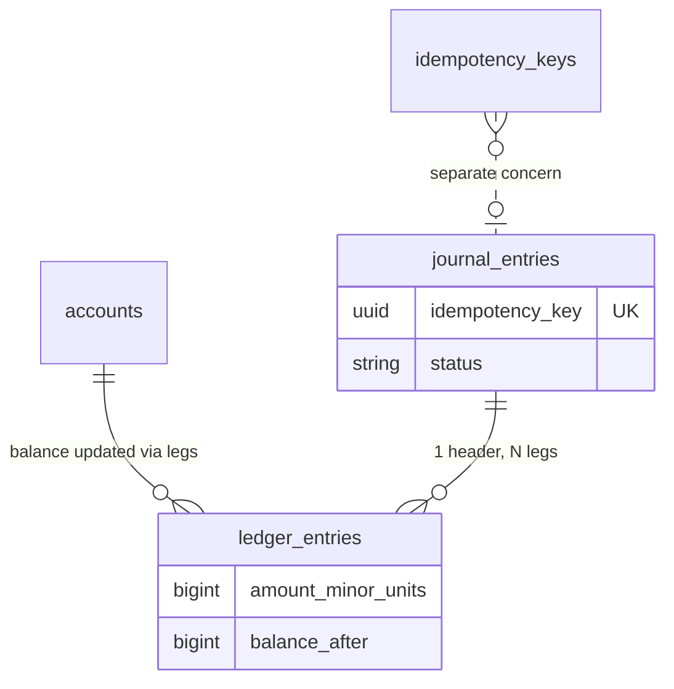
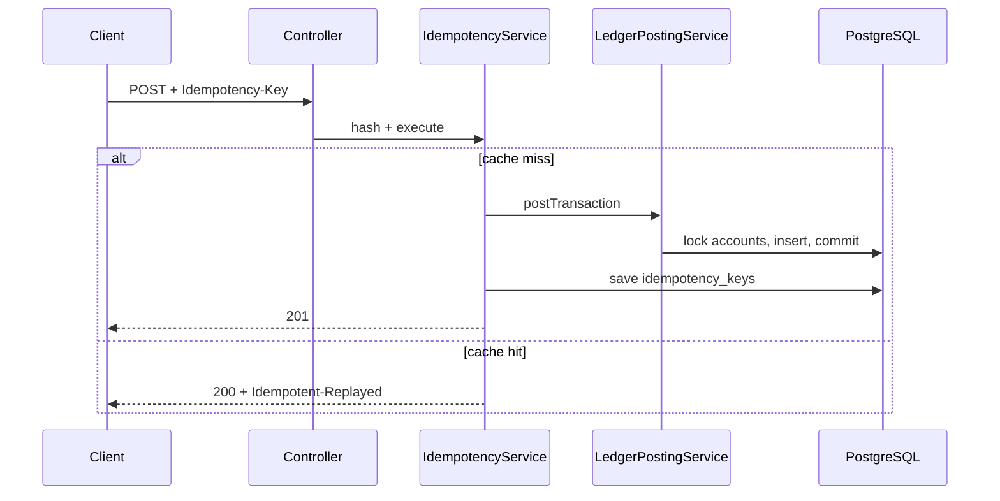

# Codebase Deep Learning Guide

> What to read, what to ask yourself, and how to know you truly understand DoubleLedger.
> Start after [UNDERSTANDING.md](./UNDERSTANDING.md) (concepts). Use alongside [CODEBASE_FLOW.md](./CODEBASE_FLOW.md) (line-by-line trace).

---

## How to use this doc

Work through **Phase 1 → 5** in order. At each step:

1. Open the file listed
2. Read it once without jumping ahead
3. Answer the **questions** out loud or in a notebook
4. Check **answers** only after you try
5. Tick the box when you can explain it without the file open

**Time estimate:** ~4–6 hours for a solid first pass. Repeat Phase 4–5 before interviews.

---

## Doc map — what each file is for

| File | Purpose | Read when |
|------|---------|-----------|
| `UNDERSTANDING.md` | Debit/credit, double-entry, ACID, idempotency concepts | First |
| `CODEBASE_FLOW.md` | Trace one HTTP request line by line | Second |
| **This file** | Questions, exercises, deep checks | Third |
| `README.md` | Run app, API curls, limitations | Anytime |
| `V1__initial_ledger_schema.sql` | Source of truth for DB rules | Phase 2 |

---

## Phase 1 — Map the territory (30 min)

### Goal
Know what exists, where it lives, and what each package owns.

### Read
```
src/main/java/com/doubleledger/ledger/
├── LedgerApplication.java
├── controller/     ← HTTP in/out
├── dto/            ← JSON shapes
├── service/        ← business logic
├── repository/     ← DB queries
├── model/          ← tables as Java classes
├── config/
└── exception/
```

### Questions — answer before moving on

| # | Question | Why it matters |
|---|----------|----------------|
| 1 | How many Java source files are there (~29)? What is deliberately **not** in the repo (auth, outbox, reversals API)? | Sets realistic scope |
| 2 | Why are there **four** database tables, not one big `transactions` table? | Core data model |
| 3 | What is the difference between a **model** (`Account.java`) and a **DTO** (`CreateAccountRequest.java`)? | Security + layering |
| 4 | Why does `createAccount` map fields manually instead of `@Autowired Account` from the request body? | Mass-assignment attack |
| 5 | Where is money stored — dollars or cents? Where is that enforced? | `balance_minor_units`, `BIGINT` |

### Self-check
- [ ] I can draw the four layers: Controller → Service → Repository → PostgreSQL
- [ ] I can name all 4 tables and one sentence for each

---

## Phase 2 — Database first (45 min)

> **Rule:** Read the schema before the Java. The DB is the final authority.

### Read in order
1. `src/main/resources/db/migration/V1__initial_ledger_schema.sql`
2. `model/Account.java`
3. `model/JournalEntry.java`
4. `model/LedgerEntry.java`
5. `model/IdempotencyKey.java`

### Questions — schema

| # | Question | Hint / answer location |
|---|----------|------------------------|
| 1 | Why is `ledger_entries.amount_minor_units` **signed** (negative = debit, positive = credit)? | Part 2, `CODEBASE_FLOW.md` |
| 2 | Why is the zero-sum trigger **DEFERRABLE INITIALLY DEFERRED** instead of running after each INSERT? | Legs inserted one row at a time in same txn |
| 3 | What happens if Java passes zero-sum but someone inserts bad data via SQL directly? | Trigger still rejects at COMMIT |
| 4 | Why does `journal_entries.idempotency_key` have a UNIQUE constraint **and** `idempotency_keys` table exists separately? | Two layers: domain vs API |
| 5 | What is `reverses_journal_entry_id` for? Is it used in Java yet? | Schema yes, API no |
| 6 | What is `metadata JSONB` for? Is it persisted today? | Schema yes — **gap:** not wired in `LedgerPostingService` |
| 7 | Why `balance_after` on each ledger leg? | Point-in-time audit / reconstruct history |

### Questions — Account entity

| # | Question |
|---|----------|
| 1 | Alice has an **asset** wallet with $100. She sends $5 out. Is that a debit or credit on her account? What happens to `balance_minor_units`? |
| 2 | Why does overdraft check run inside `debit()` and `credit()`, not in the controller? |
| 3 | What happens if `status = frozen`? Which method throws? |
| 4 | Can a client set `balanceMinorUnits` when creating an account via API? How is that prevented? |

### Visual — table relationships



### Self-check
- [ ] I can explain deferred trigger in one sentence
- [ ] I know which schema columns exist but are not used in Java yet

---

## Phase 3 — Follow the money (60 min)

> Trace **one successful transfer** from HTTP to DB rows.

### Read in this exact order

```
1. LedgerController.postTransaction()          ← entry
2. resolveDomainIdempotencyKey()               ← header rules
3. RequestHasher.hashPostTransaction()         ← fingerprint
4. IdempotencyService.executePostTransaction() ← API layer
5. LedgerPostingService.postTransaction()      ← domain layer
6. LedgerPostingService.executePosting()       ← core posting
7. AccountRepository.findAllByIdsForUpdate()   ← locks
8. Account.debit() / credit()                  ← balance math
9. JournalEntryResponse.fromEntity()           ← response
10. GlobalExceptionHandler                       ← errors
```

### Questions — request flow

| # | Question |
|---|----------|
| 1 | List every step from `POST /transactions` to `201 Created` in order. |
| 2 | Where are **two different** advisory locks acquired? What string/key does each use? |
| 3 | If idempotency replay happens, does `LedgerPostingService.postTransaction()` run again? |
| 4 | Why hash `POST:/api/v1/transactions:` + JSON instead of hashing only the idempotency key? |
| 5 | What is stored in `idempotency_keys.response_body`? |
| 6 | Why return `200` on replay but `201` on first success? Which header tells the client it was a replay? |
| 7 | `JournalEntryResponse.fromEntity()` returns `List.of()` for entries — is that intentional or a gap? |

### Questions — posting engine (`executePosting`)

| # | Question |
|---|----------|
| 1 | Why must there be at least **2** legs? |
| 2 | How is zero-sum validated in Java before any DB write? |
| 3 | Why sort account IDs before locking? What breaks if you don't? |
| 4 | Why reject multi-currency legs in one transaction? |
| 5 | In what order are rows written: journal header, ledger legs, account balances? |
| 6 | What exception type means "duplicate key race" and where is it caught? |

### Draw this from memory



### Self-check
- [ ] I can trace a transfer without opening the IDE
- [ ] I can explain why two idempotency layers exist

---

## Phase 4 — Tests prove the hard parts (45 min)

> Tests are the spec for concurrency and idempotency. Read them like documentation.

### Read
1. `IdempotencyIntegrationTest.java`
2. `LedgerPostingConcurrencyIntegrationTest.java`
3. `PostgresIntegrationTestSupport.java`

### Questions — idempotency test

| # | Question |
|---|----------|
| 1 | 50 threads, same key — how many journal entries should exist after? Why not 50? |
| 2 | Same key, **different amount** — expected HTTP status? |
| 3 | Sequential retry — what status and header? |
| 4 | Why use real Postgres (Testcontainers) instead of H2 in-memory? |

### Questions — concurrency test

| # | Question |
|---|----------|
| 1 | Wallet has balance for **9** withdrawals of $10, **10** threads try — how many succeed? |
| 2 | `crossAccountTransfers_doNotDeadlock` — why 20 rounds × 2 directions (A→B and B→A)? |
| 3 | If you removed `ORDER BY a.id` from the lock query, which test would likely fail? |

### Exercise — run tests yourself

```bash
./mvnw test -Dtest=IdempotencyIntegrationTest
./mvnw test -Dtest=LedgerPostingConcurrencyIntegrationTest
```

Watch the counts. Then re-read the test assertions and map each to a mechanism in the code.

### Self-check
- [ ] I can explain what each of the 6 tests proves
- [ ] I know why integration tests beat mocks for this project

---

## Phase 5 — Edge cases & known gaps (30 min)

> Understanding what is **not** built is as important as what is.

### Questions — things that will bite you

| # | Question | Answer (verify in code) |
|---|----------|-------------------------|
| 1 | POST without `Idempotency-Key` header? | 400 |
| 2 | Body `idempotencyKey` differs from header? | 400 |
| 3 | Unbalanced legs (debits ≠ credits)? | 400 in Java |
| 4 | Overdraft on asset account? | 400 |
| 5 | Post to frozen account? | 400 / IllegalStateException |
| 6 | Unknown account UUID in a leg? | 400 |
| 7 | Same idempotency key, different body hash? | 409 |
| 8 | GET unknown account? | 404 |
| 9 | Uncaught server bug? | 500 (generic message) |

### Known gaps — can you explain each?

| Gap | Where you see it | Business impact |
|-----|------------------|-----------------|
| No reversals API | `reverses_journal_entry_id` unused | Can't refund/correct in production |
| Metadata not saved | DTO has field, entity/service skip it | Lost audit context |
| Empty legs in response | `JournalEntryResponse.fromEntity()` | Clients can't see posting details |
| No auth | Open API | Can't deploy publicly |
| Idempotency keys never expire | No TTL job | Table grows forever |
| `ForensicAuditService` | Only on unexpected DB failures | Not full audit trail |
| `AsyncConfig` forensic executor | Bean exists, not used with `@Async` | Dead config for now |

### Self-check
- [ ] I can list 5 HTTP status codes and when each fires
- [ ] I can name 3 schema-vs-code gaps

---

## Phase 6 — Deep interview questions

Practice answering these **without code open**. If stuck, go back to the file in parentheses.

### Architecture
1. Why PostgreSQL and not MongoDB for a ledger? (`V1__...sql`, triggers, locks)
2. What is defense in depth in this project? (Java + DB trigger + unique constraints)
3. Product ledger vs General Ledger — where does DoubleLedger sit? (`UNDERSTANDING.md`)
4. Why Flyway? (`application.properties`, migration folder)

### Idempotency
5. Walk through 50 concurrent retries with the same key. (`IdempotencyIntegrationTest`)
6. Why SHA-256 the body? (`RequestHasher`)
7. What would break if you removed the API layer and kept only domain idempotency?
8. How would you add 24-hour TTL? (Stripe docs + scheduled cleanup job)

### Concurrency
9. Explain pessimistic vs optimistic locking. Which does this project use?
10. Why advisory locks **in addition to** row locks?
11. Two transfers A→B and B→A at the same time — why no deadlock? (sorted IDs)

### Double-entry
12. Post $5 from wallet to pool — which account debited, which credited? (asset rules)
13. Why immutable ledger entries? How would you fix a mistake? (reversal — planned)
14. Why store `balance_minor_units` on account **and** legs in `ledger_entries`?

### Spring / Java
15. What does `@Transactional` on `postTransaction()` guarantee?
16. Why `spring.jpa.open-in-view=false`? (`application.properties`)
17. Why manual DTO → entity mapping on account create? (`LedgerController`)

---

## Phase 7 — Hands-on exercises (learn by doing)

Do these to move from "I read it" to "I own it."

### Exercise A — Happy path with curl
1. Start Postgres + `./mvnw spring-boot:run`
2. Create two asset accounts
3. Post a $5 transfer with a UUID idempotency key → expect **201**
4. Repeat exact request → expect **200** + `Idempotent-Replayed: true`
5. Query both accounts — balances correct?

### Exercise B — Break it on purpose
Try each and note the status + message:

```bash
# Missing header
# Same key, change amount in body
# Unbalanced legs (debit $5, credit $3)
# Withdraw more than balance (no overdraft)
```

### Exercise C — Follow one row in the DB
After a transfer, query Postgres:

```sql
SELECT * FROM journal_entries ORDER BY created_at DESC LIMIT 1;
SELECT * FROM ledger_entries WHERE journal_entry_id = '<id>';
SELECT id, name, balance_minor_units FROM accounts WHERE id IN ('<alice>', '<bob>');
SELECT * FROM idempotency_keys ORDER BY created_at DESC LIMIT 1;
```

Verify: legs sum to 0, balances match, cache row exists.

### Exercise D — Add a mental feature before coding
Design (on paper) `POST /transactions/{id}/reversals`:
- Which tables change?
- New journal entry or edit old one?
- What happens to `status` and `reverses_journal_entry_id`?
- What idempotency key would the client send?

Reference: [Modern Treasury reversal API](https://docs.moderntreasury.com/platform/reference/create-ledger-transaction-reversal)

### Exercise E — Write one unit test (optional)
Pick one pure function to test without Spring:
- Zero-sum validation logic
- `Account.debit()` on asset with overdraft disabled
- `RequestHasher` — same body → same hash

---

## Mastery checklist

You **deeply** understand the codebase when you can:

### Level 1 — Reader
- [ ] Navigate all 29 Java files and say what each does in one line
- [ ] Run app and tests locally
- [ ] Execute curl happy path + one error case

### Level 2 — Tracer
- [ ] Trace POST /transactions without opening code
- [ ] Explain all 4 tables and how one transfer populates them
- [ ] Explain debit/credit for asset accounts

### Level 3 — Engineer
- [ ] Explain two-layer idempotency and two advisory lock sites
- [ ] Explain sorted `FOR UPDATE` and why deadlock test matters
- [ ] Name 5+ gaps and how you'd implement reversals or TTL

### Level 4 — Owner
- [ ] Implement a small feature (reversal, metadata persist, or unit test) following existing patterns
- [ ] Defend design choices in a mock interview for 30 minutes
- [ ] Critique what you'd change before production (auth, outbox, observability)

---

## Suggested reading order (one sitting)

```
Day 1  UNDERSTANDING.md + schema SQL + model/*.java
Day 2  CODEBASE_FLOW.md Part 5 + LedgerController + LedgerPostingService
Day 3  IdempotencyService + RequestHasher + tests
Day 4  Exercises A–C + mastery checklist Level 2
Day 5  Phase 6 interview questions + Exercise D (design reversal)
```

---

## Quick file reference

| File | One question to ask while reading |
|------|-----------------------------------|
| `LedgerController.java` | What happens before posting service is called? |
| `IdempotencyService.java` | When is response cached vs replayed? |
| `RequestHasher.java` | What exactly goes into the hash string? |
| `LedgerPostingService.java` | Where could money be lost if a step were skipped? |
| `Account.java` | Why does debit/credit depend on account type? |
| `AccountRepository.java` | Why `PESSIMISTIC_WRITE` and `ORDER BY id`? |
| `GlobalExceptionHandler.java` | Which exceptions become 400 vs 409 vs 500? |
| `V1__initial_ledger_schema.sql` | What survives even if Java has a bug? |
| `IdempotencyIntegrationTest.java` | What production bug does this prevent? |
| `LedgerPostingConcurrencyIntegrationTest.java` | What production bug does this prevent? |

---

## Further reading (after codebase)

| Topic | Link |
|-------|------|
| Stripe idempotency | https://docs.stripe.com/api/idempotent_requests |
| Modern Treasury reversals | https://docs.moderntreasury.com/platform/reference/create-ledger-transaction-reversal |
| Transactional outbox (Block 2) | https://microservices.io/patterns/data/transactional-outbox.html |
| PostgreSQL advisory locks | https://www.postgresql.org/docs/current/explicit-locking.html |

---

*Next step after this doc: pick one P0 gap (reversals, metadata, or unit tests) and implement it using the pattern in `CODEBASE_FLOW.md` Part 12.*
