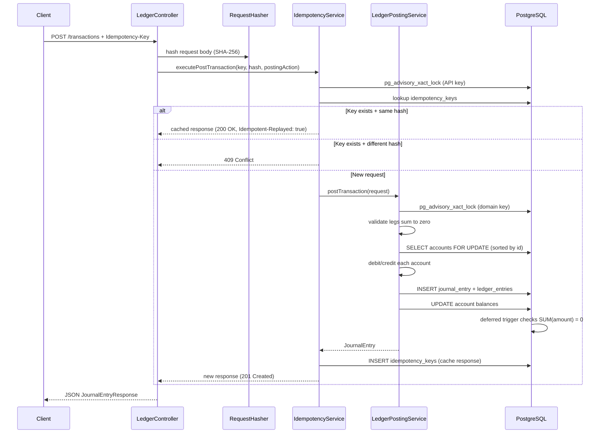
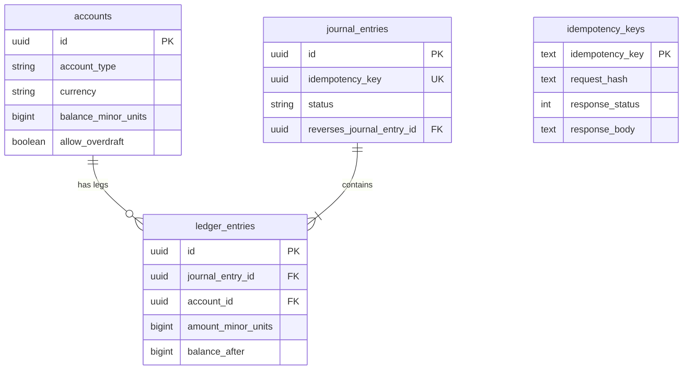

# DoubleLedger — ledger-core

A **double-entry financial ledger** built with **Java 21**, **Spring Boot 4**, and **PostgreSQL**.

Money never appears or disappears — it only moves. Every transaction is recorded as balanced legs (debits = credits), stored atomically, and protected against duplicate requests and concurrent race conditions.

This is **Block 1** of a larger system. Later blocks (event outbox, webhooks, fraud rules) will consume ledger events — this service is scoped to be the single source of truth for balances.

---

## Table of contents

1. [Quick start](#quick-start)
2. [Is the app "complete"?](#is-the-app-complete)
3. [Architecture overview](#architecture-overview)
4. [Code map](#code-map)
5. [Data flow — start to finish](#data-flow--start-to-finish)
6. [Database design](#database-design)
7. [Rules & principles](#rules--principles)
8. [Testing](#testing)
9. [Docker — what it does here](#docker--what-it-does-here)
10. [API examples](#api-examples)
11. [Limitations (v1)](#limitations-v1)
12. [What's next](#whats-next)

---

## Quick start

### Prerequisites


| Requirement    | Why                                                                            |
| -------------- | ------------------------------------------------------------------------------ |
| **Java 21+**   | Project target (`pom.xml`). Java 26 works too.                                 |
| **Maven**      | Included via `./mvnw` wrapper — no separate install needed.                    |
| **PostgreSQL** | Required to run the app locally.                                               |
| **Docker**     | Required for integration tests (Testcontainers). Optional for running the app. |


**Set Java (if your default is 17):**

```bash
# Option A — Java 26 (already on your machine)
export JAVA_HOME="/opt/homebrew/Cellar/openjdk/26.0.1/libexec/openjdk.jdk/Contents/Home"

# Option B — install Java 21
brew install openjdk@21
export JAVA_HOME="/opt/homebrew/opt/openjdk@21/libexec/openjdk.jdk/Contents/Home"
```

### Run the app

1. Start PostgreSQL with a database matching `application.properties`:
  ```
   Host:     localhost:5433
   Database: ledger_db
   User:     ledger_admin
   Password: ledger1234
  ```
2. Start Spring Boot:
  ```bash
   cd ledger
   ./mvnw spring-boot:run
  ```
   Flyway runs migrations automatically on startup. The app listens on **port 8080** by default.

### Run tests

```bash
# All tests
./mvnw clean test

# Integration tests only (6 tests)
./mvnw clean test -Dtest="*IntegrationTest*,LedgerApplicationTests"

# One test class
./mvnw test -Dtest=IdempotencyIntegrationTest

# One test method
./mvnw test -Dtest=IdempotencyIntegrationTest#sequentialReplay_returns200WithReplayHeader
```

**Expected result when healthy:**

```
Tests run: 6, Failures: 0, Errors: 0, Skipped: 0
BUILD SUCCESS
```

---

## Is the app "complete"?

For **Block 1 (core ledger)**, the app is working when all of these are true:


| Check                    | How to verify                                                       |
| ------------------------ | ------------------------------------------------------------------- |
| Spring context starts    | `LedgerApplicationTests.contextLoads` passes                        |
| Database schema is valid | Flyway migration `V1__initial_ledger_schema.sql` runs without error |
| Posting works            | Integration tests pass (balance updates, zero-sum enforced)         |
| Idempotency works        | 50 concurrent retries → 1 create + 49 replays                       |
| Concurrency is safe      | 10 parallel withdrawals → exactly 1 rejection, no deadlock          |
| API is reachable         | `POST /api/v1/accounts` and `POST /api/v1/transactions` return 201  |


**What is NOT done yet** (see [What's next](#whats-next)): transaction reversals, unit tests, Docker Compose for local dev, CI pipeline, event outbox.

---

## Architecture overview

```
┌─────────────────────────────────────────────────────────────────┐
│                         HTTP Client                              │
└────────────────────────────┬────────────────────────────────────┘
                             │  POST /api/v1/transactions
                             │  Header: Idempotency-Key
                             ▼
┌─────────────────────────────────────────────────────────────────┐
│  controller/                                                     │
│  LedgerController          GlobalExceptionHandler                │
└────────────────────────────┬────────────────────────────────────┘
                             │
              ┌──────────────┼──────────────┐
              ▼              ▼              ▼
┌──────────────────┐ ┌─────────────┐ ┌──────────────────┐
│ IdempotencyService│ │RequestHasher│ │LedgerPostingService│
│ (API-layer cache) │ │ (SHA-256)   │ │ (core engine)     │
└────────┬─────────┘ └─────────────┘ └────────┬─────────┘
         │                                     │
         └──────────────┬──────────────────────┘
                        ▼
┌─────────────────────────────────────────────────────────────────┐
│  repository/          JPA + Hibernate                            │
│  AccountRepository · JournalEntryRepository · LedgerEntryRepository│
│  IdempotencyKeyRepository                                         │
└────────────────────────────┬────────────────────────────────────┘
                             │  SELECT ... FOR UPDATE (row locks)
                             │  pg_advisory_xact_lock (idempotency)
                             ▼
┌─────────────────────────────────────────────────────────────────┐
│  PostgreSQL                                                      │
│  Flyway migrations · constraint triggers · ACID transactions     │
└─────────────────────────────────────────────────────────────────┘
```

### Layer responsibilities


| Layer                    | Responsibility                                              |
| ------------------------ | ----------------------------------------------------------- |
| **Controller**           | HTTP in/out, validation, idempotency header parsing         |
| **IdempotencyService**   | API-layer dedup — replay cached HTTP responses on retry     |
| **LedgerPostingService** | Domain logic — lock accounts, apply legs, update balances   |
| **Account (entity)**     | Debit/credit rules per account type, overdraft checks       |
| **Repository**           | Database access with pessimistic write locks                |
| **PostgreSQL**           | Final backstop — zero-sum trigger, unique constraints, ACID |


---

## Code map

```
ledger/
├── src/main/java/com/doubleledger/ledger/
│   ├── LedgerApplication.java          ← Spring Boot entry point
│   │
│   ├── controller/
│   │   ├── LedgerController.java       ← REST API (/accounts, /transactions)
│   │   └── GlobalExceptionHandler.java ← 400 / 409 / 500 error responses
│   │
│   ├── dto/                            ← Request/response shapes (no business logic)
│   │   ├── CreateAccountRequest.java
│   │   ├── PostTransactionRequest.java
│   │   ├── TransactionLegDto.java
│   │   └── *Response.java
│   │
│   ├── service/
│   │   ├── LedgerPostingService.java   ← Core posting engine
│   │   ├── IdempotencyService.java     ← API idempotency cache
│   │   ├── RequestHasher.java          ← SHA-256 fingerprint of request body
│   │   └── ForensicAuditService.java   ← Structured error logging
│   │
│   ├── repository/                     ← Spring Data JPA interfaces
│   │   ├── AccountRepository.java      ← includes findAllByIdsForUpdate()
│   │   ├── JournalEntryRepository.java
│   │   ├── LedgerEntryRepository.java
│   │   └── IdempotencyKeyRepository.java
│   │
│   ├── model/                          ← JPA entities ↔ database tables
│   │   ├── Account.java                ← debit(), credit(), validateOverdraft()
│   │   ├── JournalEntry.java           ← transaction header
│   │   ├── LedgerEntry.java            ← one leg (signed amount)
│   │   └── IdempotencyKey.java         ← cached API response
│   │
│   └── config/
│       └── AsyncConfig.java
│
├── src/main/resources/
│   ├── application.properties          ← DB connection, Flyway, logging
│   └── db/migration/
│       └── V1__initial_ledger_schema.sql
│
└── src/test/java/com/doubleledger/ledger/
    ├── support/
    │   └── PostgresIntegrationTestSupport.java  ← Testcontainers + helpers
    ├── LedgerApplicationTests.java              ← smoke test
    ├── IdempotencyIntegrationTest.java          ← HTTP idempotency (3 tests)
    └── LedgerPostingConcurrencyIntegrationTest.java ← locking (2 tests)
```

---

## Data flow — start to finish

### Example: transfer $5.00 from Wallet → Pool

**Request:**

```http
POST /api/v1/transactions
Idempotency-Key: 550e8400-e29b-41d4-a716-446655440000

{
  "description": "transfer to pool",
  "legs": [
    { "accountId": "<wallet-uuid>", "amountMinorUnits": 500, "direction": "CREDIT" },
    { "accountId": "<pool-uuid>",   "amountMinorUnits": 500, "direction": "DEBIT"  }
  ]
}
```

> Amounts are in **minor units** (cents). 500 = $5.00. No floats anywhere.

### Step-by-step flow




### What gets written to the database

For one $5.00 transfer, three rows change:

```
journal_entries          ledger_entries                    accounts
─────────────────        ─────────────────────────────     ────────────────
id: je-001               leg 1: wallet  amount = +500      wallet: 9500 → 9000
idempotency_key: ...     leg 2: pool    amount = -500      pool:   0    → 500
description: "transfer"  balance_after on each leg
status: posted
```

Signed amounts: **negative = debit**, **positive = credit**. They must sum to **zero** per journal entry (enforced by a deferred DB trigger at commit time).

---

## Database design




### Two idempotency layers (not redundant)


| Layer      | Table                             | Purpose                                                                  |
| ---------- | --------------------------------- | ------------------------------------------------------------------------ |
| **API**    | `idempotency_keys`                | Client retried HTTP call → replay exact same JSON response               |
| **Domain** | `journal_entries.idempotency_key` | Same business event can't be posted twice, even via different code paths |


Both use **Postgres advisory locks** (`pg_advisory_xact_lock`) to serialize concurrent requests with the same key.

---

## Rules & principles

### Accounting rules

1. **Double-entry invariant** — every journal entry's legs sum to zero (debits = credits).
2. **No floats** — all money stored as `BIGINT` minor units (cents).
3. **Single currency per transaction** — multi-currency requires explicit FX/clearing accounts (v2).
4. **Immutability** — entries are never edited or deleted; corrections will be reversals (not yet implemented).

### Concurrency rules

1. **Pessimistic locking** — accounts are locked with `SELECT ... FOR UPDATE` before balance changes.
2. **Sorted lock order** — account IDs are locked in sorted order to prevent deadlocks.
3. **Advisory locks** — idempotency keys are serialized at both API and domain layers.

### Defense in depth


| Check                     | Where                                | What happens on failure                |
| ------------------------- | ------------------------------------ | -------------------------------------- |
| Legs balance to zero      | Java (`LedgerPostingService`)        | `400 Bad Request` before DB write      |
| Legs balance to zero      | PostgreSQL trigger                   | Transaction rolled back — can't commit |
| Overdraft                 | Java (`Account.validateOverdraft()`) | `400 Bad Request`                      |
| Duplicate idempotency key | Java + DB unique constraint          | Replay or `409 Conflict`               |
| Same key, different body  | Java (`IdempotencyService`)          | `409 Conflict`                         |


### API rules

- Every `POST /transactions` requires an `Idempotency-Key` header (UUID).
- Request body `idempotencyKey` must match the header if present.
- First successful post → `201 Created`. Exact retry → `200 OK` + `Idempotent-Replayed: true`.

---

## Testing

### Philosophy

Integration tests boot the **real Spring application** against a **real PostgreSQL** database. No mocks for the database — this proves Flyway migrations, JPA mappings, locking, and triggers all work together.

### Tools


| Tool                 | Role                                                 |
| -------------------- | ---------------------------------------------------- |
| **JUnit 5**          | Test framework (`@Test`, `@BeforeEach`)              |
| **Spring Boot Test** | `@SpringBootTest` — loads full application context   |
| **Testcontainers**   | Spins up `postgres:16-alpine` in Docker during tests |
| **AssertJ**          | Readable assertions (`assertThat(x).isEqualTo(y)`)   |
| **RestTestClient**   | HTTP tests without manually starting a server        |
| **Flyway**           | Same migrations run in tests as in production        |
| **Maven Surefire**   | Runs tests via `./mvnw test`                         |


### Test suite (6 tests)


| Test                                                          | Layer   | What it proves                                       |
| ------------------------------------------------------------- | ------- | ---------------------------------------------------- |
| `contextLoads`                                                | Smoke   | Spring Boot + Postgres + Flyway all wire up          |
| `sameIdempotencyKey_concurrentPosts_createSingleJournalEntry` | HTTP    | 50 threads, 1 create + 49 replays                    |
| `sameIdempotencyKey_differentPayload_returns409`              | HTTP    | Same key + different amount → conflict               |
| `sequentialReplay_returns200WithReplayHeader`                 | HTTP    | Retry returns cached response                        |
| `concurrentWithdrawals_exhaustBalanceExactlyOneFails`         | Service | 10 threads, balance for 9 → 1 rejection, balance = 0 |
| `crossAccountTransfers_doNotDeadlock`                         | Service | 40 bidirectional A↔B transfers, no deadlock          |


### How tests get a database

```
PostgresIntegrationTestSupport (base class for all integration tests)
        │
        ├── Docker available?
        │     YES → Testcontainers starts postgres:16-alpine
        │           @DynamicPropertySource wires JDBC URL/username/password
        │
        └── NO  → Falls back to localhost:5433
                  (or force with -Dtest.useLocalPostgres=true)
```

Every test class extends `PostgresIntegrationTestSupport`, which provides:

- Automatic Postgres setup
- `createAssetAccount(name)` helper
- `buildTransfer(from, to, amount, idempotencyKey)` helper

---

## Docker — what it does here

**Docker is used for testing, not for running the app (yet).**

```
┌──────────────────────────────────────────────────────────┐
│  ./mvnw test                                              │
│       │                                                   │
│       ▼                                                   │
│  Testcontainers ──► Docker ──► postgres:16-alpine         │
│       │                      (ephemeral, destroyed after) │
│       ▼                                                   │
│  Spring Boot test context connects to that Postgres       │
│  Flyway runs V1 migration                                 │
│  Tests run against real schema + real locks + real triggers│
└──────────────────────────────────────────────────────────┘
```


| Scenario                                | Docker needed?                                                   |
| --------------------------------------- | ---------------------------------------------------------------- |
| Run integration tests                   | **Yes** — Testcontainers requires Docker running                 |
| Run the app locally (`spring-boot:run`) | **No** — uses Postgres at `localhost:5433`                       |
| Run tests without Docker                | Use `-Dtest.useLocalPostgres=true` + local Postgres on port 5433 |


**Make sure Docker Desktop is running before `./mvnw test`.**

---

## API examples

### Create an account

```bash
curl -s -X POST http://localhost:8080/api/v1/accounts \
  -H "Content-Type: application/json" \
  -d '{
    "name": "wallet",
    "accountType": "asset",
    "normalBalance": "D",
    "currency": "USD",
    "allowOverdraft": false,
    "overdraftLimitMinorUnits": 0
  }' | jq
```

### Post a transaction

```bash
curl -s -X POST http://localhost:8080/api/v1/transactions \
  -H "Content-Type: application/json" \
  -H "Idempotency-Key: 550e8400-e29b-41d4-a716-446655440000" \
  -d '{
    "description": "transfer to pool",
    "legs": [
      { "accountId": "<wallet-uuid>", "amountMinorUnits": 500, "direction": "CREDIT" },
      { "accountId": "<pool-uuid>",   "amountMinorUnits": 500, "direction": "DEBIT"  }
    ]
  }' | jq
```

### Get account balance

```bash
curl -s http://localhost:8080/api/v1/accounts/<account-uuid> | jq
```

### Retry (idempotent replay)

Send the exact same request again with the same `Idempotency-Key`:

```
HTTP/1.1 200 OK
Idempotent-Replayed: true
```

---

## Limitations (v1)


| Limitation                          | Detail                                                                                 |
| ----------------------------------- | -------------------------------------------------------------------------------------- |
| **No transaction reversals**        | Schema supports `reverses_journal_entry_id` but no API endpoint yet                    |
| **Single currency per transaction** | Cross-currency FX not supported                                                        |
| **Denormalized balance**            | `accounts.balance_minor_units` is cached — hot accounts become a throughput bottleneck |
| **No unit tests**                   | Only integration tests exist today                                                     |
| **No Docker Compose**               | App + Postgres not bundled for one-command local dev                                   |
| **No CI pipeline**                  | Tests not automated on push yet                                                        |
| **No authentication**               | API is open — no auth layer                                                            |
| **No event outbox**                 | Downstream systems can't subscribe to ledger events yet                                |
| **Idempotency keys never expire**   | No TTL/cleanup policy                                                                  |
| **failed_entries table**            | Designed in schema docs but not implemented in code                                    |


---

## What's next

Recommended order for Block 1 completion and Block 2 start:

```
Phase A — Finish Block 1
  ├── Unit tests (validation, overdraft, zero-sum rejection)
  ├── POST /transactions/{id}/reversals endpoint
  ├── Docker Compose (app + Postgres, one command)
  └── GitHub Actions CI (run tests on every push)

Phase B — Block 2 (event layer)
  ├── Transactional outbox table
  ├── Publish journal_entry.posted events
  └── Webhook delivery service
```

---

## Tech stack


| Component        | Version / choice                            |
| ---------------- | ------------------------------------------- |
| Java             | 21                                          |
| Spring Boot      | 4.1.0                                       |
| PostgreSQL       | 16 (Testcontainers)                         |
| Flyway           | Schema migrations                           |
| JPA / Hibernate  | ORM                                         |
| Testcontainers   | Integration test database                   |
| Jackson 2        | JSON serialization (`spring-boot-jackson2`) |
| Logstash encoder | Structured ECS logging                      |


---

## Further reading

The original deep-dive design notes (TigerBeetle vs Formance comparisons, schema rationale, terminology) lived in earlier versions of this file. The schema migration at `src/main/resources/db/migration/V1__initial_ledger_schema.sql` is the authoritative source for database constraints and triggers.