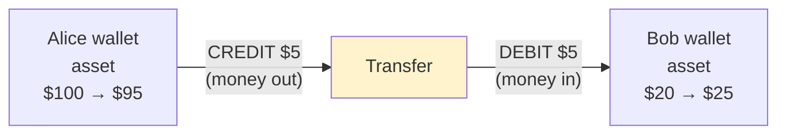
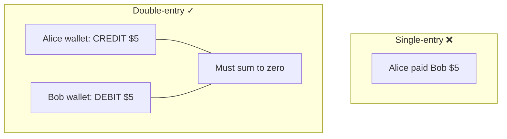
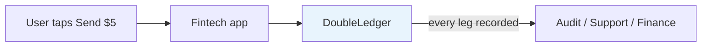
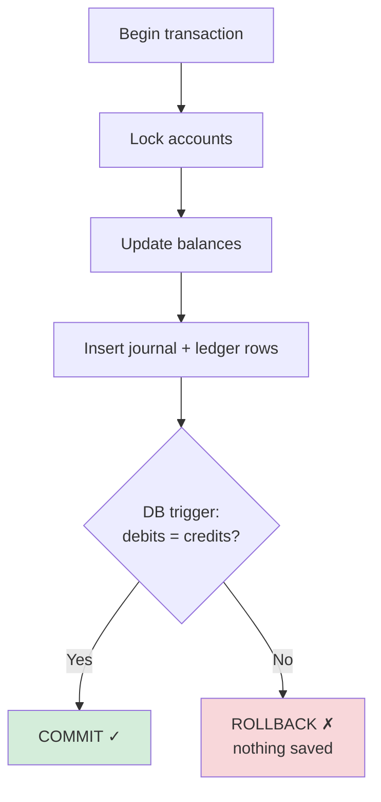
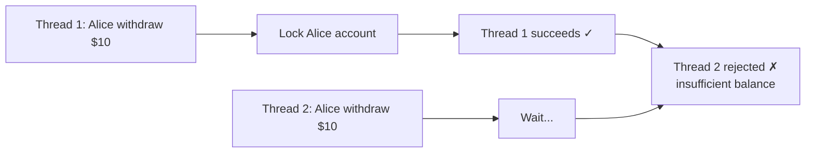
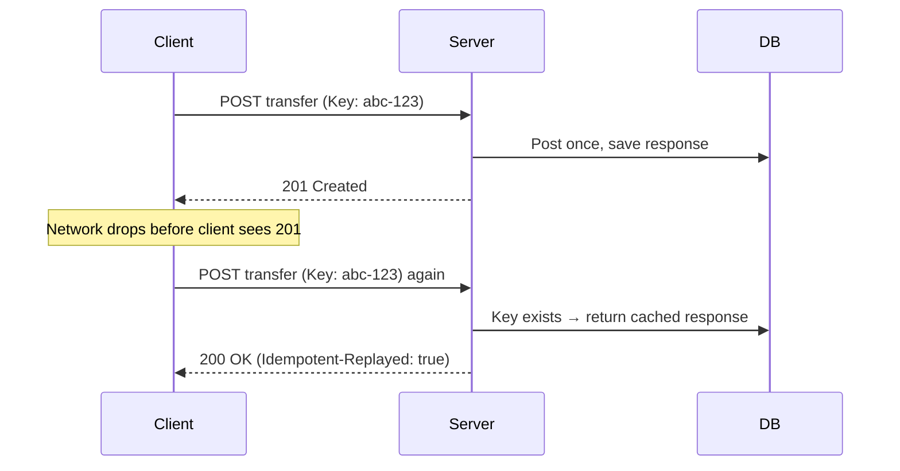
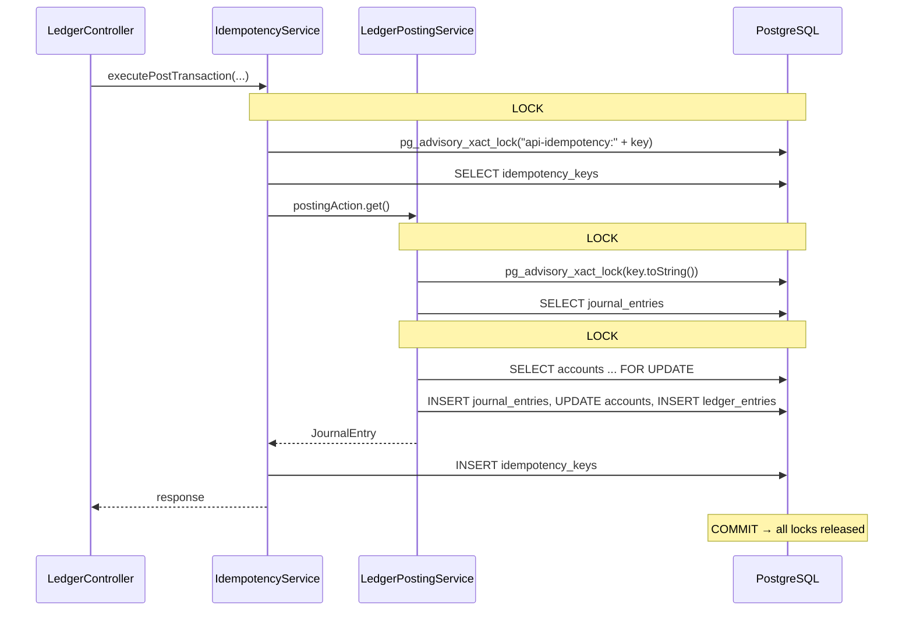
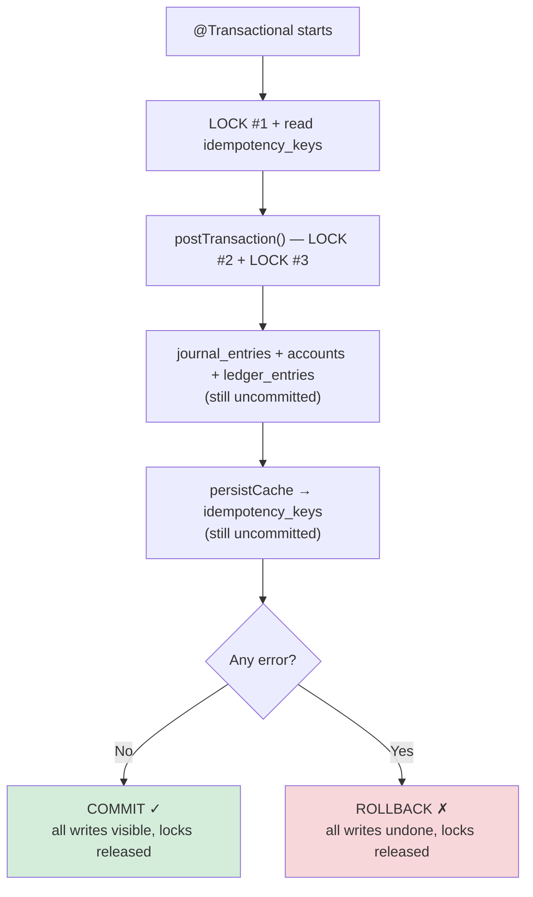
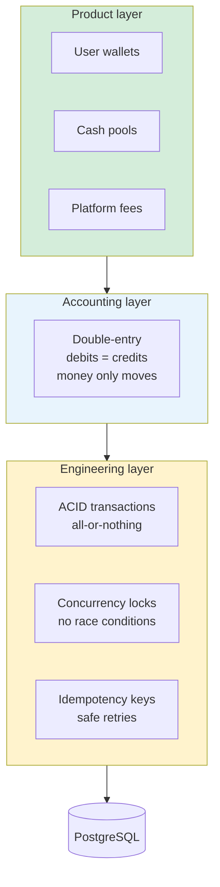

# Understanding Double-Entry Ledger — A Simple Guide

> How I understood it, written so anyone reading this project can follow along step by step.

---

## Step 1 — Debit and Credit (clearing the confusion)

Most people get confused here because **your bank uses the opposite perspective**.

### What your bank tells you

| Bank says | What actually happened to **your** money |
|-----------|------------------------------------------|
| "Your account was **debited** $50" | $50 **left** your account |
| "Your account was **credited** $50" | $50 **came into** your account |

That feels backwards. Here's why.

### The bank is looking from *their* side

To the bank, **your savings account is their liability** — they owe you that money.

```
Bank's view of YOUR account:
  Your account = LIABILITY (bank owes you)

  Bank debits your account  →  their liability goes DOWN  →  your balance goes DOWN
  Bank credits your account →  their liability goes UP    →  your balance goes UP
```

So when the bank says "debited," they mean debited **on their books** — which means money left **your** pocket.

> **Rule of thumb:** Bank language = mirror image of yours. Ignore bank wording until you know which side of the book you're on.

### What debit and credit actually mean

In accounting, **debit and credit are not "good" or "bad."** They are just two directions — like `+` and `-` on different account types.

Think of it as two columns on a spreadsheet:

```
         DEBIT  |  CREDIT
         -------+--------
         left   |  right
```

Every transaction touches **both** sides. One account gets a debit, another gets a credit. They always balance.

### The simple table — when does balance go up or down?

In **DoubleLedger**, a user wallet is an **asset** account. Here is the full picture:

| Account type | Examples in fintech | Debit effect | Credit effect | Normal balance |
|--------------|---------------------|--------------|---------------|----------------|
| **Asset** | User wallet, cash pool | Balance **goes UP** ↑ | Balance **goes DOWN** ↓ | Debit (D) |
| **Liability** | Money owed to merchants | Balance **goes DOWN** ↓ | Balance **goes UP** ↑ | Credit (C) |
| **Equity** | Company's own capital | ↓ | ↑ | Credit (C) |
| **Revenue** | Platform fees earned | ↓ | ↑ | Credit (C) |
| **Expense** | Payouts, costs | ↑ | ↓ | Debit (D) |

**The one line to remember for wallets (assets):**

```
Debit  = money IN  (balance increases)
Credit = money OUT (balance decreases)
```

That matches what most developers expect — as long as you're working with **asset** accounts.

### Quick example — Alice sends $5 to Bob

```
Alice's wallet (asset):  CREDIT $5  →  balance goes DOWN by $5
Bob's wallet (asset):    DEBIT  $5  →  balance goes UP by $5

Total debits  = $5
Total credits = $5
Difference    = $0   ✓  balanced
```



---

## Step 2 — What is double-entry (double ledger)?

**Single-entry** (like a personal diary):

```
Alice paid Bob $5.
```

One line. Simple — but you can't prove nothing was lost, duplicated, or invented.

**Double-entry** (what this project uses):

```
Every movement is recorded as TWO OR MORE legs.
Debits = Credits. Always.
Money is never created or destroyed — only moved.
```



In DoubleLedger, one transfer creates:

| Layer | What gets stored |
|-------|------------------|
| **Journal entry** | The event — "Alice → Bob $5" |
| **Ledger entries** | The legs — one debit leg, one credit leg per account touched |

```
journal_entries          ledger_entries
┌─────────────────┐      ┌──────────────────────────┐
│ Transfer $5     │──────│ Alice: -500 (credit leg) │
│ idempotency_key │      │ Bob:   +500 (debit leg)  │
└─────────────────┘      └──────────────────────────┘
                         -500 + 500 = 0  ✓
```

---

## Step 3 — Why is this needed in a fintech product?

A fintech app needs to answer one question at all times:

> **"Who has how much money, and where did it come from?"**

Double-entry gives you four things a simple balance field cannot:

| Need | How double-entry helps |
|------|------------------------|
| **No lost money** | Every dollar in = a dollar out somewhere. Nothing appears from thin air. |
| **Full audit trail** | You can replay every leg and reconstruct any balance at any point in time. |
| **Corrections without lies** | You don't edit old rows — you post a reversal. History stays honest. |
| **Regulatory trust** | Finance teams, auditors, and partners expect this model. |



### Product ledger vs General Ledger

DoubleLedger is a **product ledger** — it tracks real-time balances inside your app (wallets, pools, fees).

It is **not** the General Ledger (GL) that finance uses for quarterly reports (NetSuite, QuickBooks). Those sync from product ledgers later.

---

## Step 4 — Who uses it?

| Who | Why they care |
|-----|---------------|
| **Engineers** | Build posting APIs, handle retries and concurrency |
| **Product / Ops** | See user balances, investigate failed transfers |
| **Finance / Accounting** | Reconcile app balances against bank statements |
| **Auditors / Compliance** | Verify no money was created or lost |
| **End users** | Indirectly — they trust their balance is correct |

Companies that run this pattern internally or as a product: **Stripe**, **Modern Treasury**, **Formance**, banks, payment processors, wallet apps.

---

## Step 5 — Core engineering concepts in this project

Double-entry is the *accounting* idea. These are the *engineering* ideas that make it safe in production.

### ACID — one transfer is all-or-nothing

**A**tomicity · **C**onsistency · **I**solation · **D**urability

```
Transfer $5 from Alice to Bob:

  Either BOTH happen:          Or NEITHER happens:
  ✓ Alice -$5                  ✗ Alice still $100
  ✓ Bob   +$5                  ✗ Bob   still $20

  Never: Alice -$5 but Bob unchanged  ← that would be a disaster
```

PostgreSQL wraps the whole post in one transaction. If anything fails (overdraft, zero-sum violation), **everything rolls back**.



**Why required:** Partial updates = lost or duplicated money.

---

### Concurrency — many users at the same time

Problem: Alice has $10. Two requests try to withdraw $10 at the exact same millisecond.

Without protection → both might succeed → Alice at -$10.

**What DoubleLedger does:**

| Mechanism | What it prevents |
|-----------|------------------|
| `SELECT ... FOR UPDATE` | Two threads updating the same account at once |
| Lock accounts in **sorted ID order** | Deadlock when A→B and B→A happen simultaneously |
| `pg_advisory_xact_lock` | Two threads processing the same idempotency key |



**Why required:** Fintech apps handle thousands of concurrent money movements. Race conditions = real financial loss.

---

### Idempotency — safe retries when the network fails

Problem: Client sends "transfer $5." Server processes it. Response gets lost. Client retries.

Without idempotency → $5 transferred **twice**.

**What DoubleLedger does:**

```
Client sends:  Idempotency-Key: abc-123  (a UUID in the HTTP header)

First request:   server posts transfer  →  201 Created
Retry (same key, same body):             →  200 OK  (cached response, no second post)
Retry (same key, DIFFERENT body):        →  409 Conflict
```



Two layers in this project:

| Layer | Table | Purpose |
|-------|-------|---------|
| **API layer** | `idempotency_keys` | Replay the exact HTTP response |
| **Domain layer** | `journal_entries.idempotency_key` | Never post the same business event twice |

The request body is **SHA-256 hashed** so the same key can't be reused with different amounts.

**Why required:** Network retries are normal. Without idempotency, retries = duplicate charges. [Stripe uses the same pattern.](https://docs.stripe.com/api/idempotent_requests)

---

### Why three locks? (and where they live in code)

On a **first-time** post, the code acquires **three separate locks** inside **one database transaction**. They solve **three different race problems**. They are not redundant.



| Lock | File | Method | What it locks | Problem it prevents |
|------|------|--------|---------------|---------------------|
| **#1 API advisory** | `IdempotencyService.java` | `acquireAdvisoryLock()` | Logical slot for `"api-idempotency:" + header key` | Two HTTP retries both miss `idempotency_keys` cache and both call posting |
| **#2 Domain advisory** | `LedgerPostingService.java` | `acquireIdempotencyAdvisoryLock()` | Logical slot for `idempotencyKey.toString()` (no prefix — different hash from #1) | Two threads both miss `journal_entries` check and both insert the same business event |
| **#3 Row lock** | `AccountRepository.java` | `findAllByIdsForUpdate()` | Actual rows in `accounts` (`SELECT ... FOR UPDATE`, IDs sorted) | Two transfers updating the same wallet at once; also avoids deadlock when A→B and B→A run together |

**Why advisory lock + row lock?** Advisory locks serialize **idempotency key handling** without needing a row in a table yet. Row locks serialize **balance updates** on real account rows. See [PostgreSQL explicit locking](https://www.postgresql.org/docs/current/explicit-locking.html) and the project's `CODEBASE_FLOW.md` § "Pessimistic locking + sorted account IDs".

**Why two advisory locks (API + domain)?** Two layers, two tables, two code paths:

| Layer | Table | Lock prefix |
|-------|-------|-------------|
| API cache | `idempotency_keys` | `"api-idempotency:" + key` |
| Domain ledger | `journal_entries` | key UUID only |

Even if the API cache failed, domain idempotency still blocks a duplicate post. Even if domain logic were called from another endpoint later, the API layer still replays the exact HTTP response. See `README.md` § "Two idempotency layers".

**On a retry (cache hit):** only LOCK #1 runs briefly — `postingService` is never called, so LOCK #2 and #3 never happen.

**Tests that prove lock safety:** `LedgerPostingConcurrencyIntegrationTest.java` (parallel withdrawals, bidirectional A↔B without deadlock).

---

### What happens on error? (rollback)

Both `IdempotencyService.executePostTransaction()` and `LedgerPostingService.postTransaction()` are annotated with `@Transactional`. When the controller calls idempotency, which then calls posting, Spring joins them into **one transaction** (default propagation `REQUIRED`).

**Rule:** If anything throws before commit → **nothing** from that request is saved. PostgreSQL rolls back the whole unit of work and **all locks are released automatically**.



#### Example failures and what rolls back

| Failure | Where | HTTP | DB after rollback |
|---------|-------|------|-------------------|
| Fewer than 2 legs | `executePosting()` Java check | 400 | Nothing written — failed before any INSERT |
| Debits ≠ credits (`sum != 0`) | `executePosting()` Java check | 400 | Nothing written |
| Account not found | `executePosting()` Java check | 400 | Nothing written |
| Overdraft not allowed | `Account.validateOverdraft()` | 400 | Nothing written — may have INSERTed `journal_entries` first, but **rollback removes it too** |
| Legs don't sum to zero at commit | PostgreSQL deferred trigger `trg_check_journal_entry_balances` | 500 | **Entire transaction** rolled back — journal, accounts, ledger entries, idempotency cache |
| Same key, different body | `IdempotencyService.replayCached()` | 409 | No posting ran — nothing to roll back |

**Important detail:** `journal_entries` is saved **before** the leg loop, but it is still inside the same transaction. If `account.debit()` throws (overdraft) or the DB trigger fails at commit, the journal header row is **not** left behind — rollback removes it.

**Idempotency cache:** `idempotency_keys` is written **after** posting returns, still in the same transaction. If posting fails, the API cache row is **not** saved either — so a retry can safely attempt the post again.

**Unexpected infrastructure errors:** `LedgerPostingService.postTransaction()` catches `DataIntegrityViolationException`, tries to return an existing `journal_entries` row (race replay), otherwise logs via `ForensicAuditService` and rethrows → rollback.

#### Mental model

```
Think of the whole first-time request as one shopping cart checkout:

  Items added to cart  =  journal + accounts + ledger + idempotency cache
  Payment fails        =  ROLLBACK
  Result               =  cart emptied — as if you never checked out
```

See also `README.md` § "Defense in depth" for the Java vs PostgreSQL double-check on zero-sum legs.

---

## Step 6 — How it all fits together



---

## Cheat sheet (pin this)

```
DEBIT / CREDIT (asset accounts like wallets)
  Debit  = money IN   (↑ balance)
  Credit = money OUT  (↓ balance)

DOUBLE-ENTRY
  Every transaction = 2+ legs, debits = credits, sum = 0

WHY
  No lost money · full audit trail · honest corrections · regulatory trust

WHO
  Engineers · ops · finance · auditors · (indirectly) end users

ACID
  All-or-nothing — partial updates never commit

CONCURRENCY
  Lock accounts before updating — one winner per balance
  Three locks on first post: API advisory, domain advisory, account FOR UPDATE

ROLLBACK
  One @Transactional — any error before commit = nothing saved, all locks released

IDEMPOTENCY
  Same request key + same body = same result, never charged twice
```

---

## Further reading

| Topic | Link |
|-------|------|
| Stripe idempotency | https://docs.stripe.com/api/idempotent_requests |
| PostgreSQL advisory locks | https://www.postgresql.org/docs/current/explicit-locking.html |
| PostgreSQL transaction isolation | https://www.postgresql.org/docs/current/transaction-iso.html |
| Spring `@Transactional` rollback | https://docs.spring.io/spring-framework/reference/data-access/transaction/declarative/annotations.html |
| Modern Treasury — immutability | https://www.moderntreasury.com/journal/enforcing-immutability-in-your-double-entry-ledger |
| Formance ledger basics | https://docs.formance.com/modules/ledger |
| This project's architecture diagrams | See `README.md` and `CODEBASE_FLOW.md` |
| Concurrency integration tests | `src/test/java/.../LedgerPostingConcurrencyIntegrationTest.java` |

---

*Written as part of the DoubleLedger project — Block 1 core ledger.*
